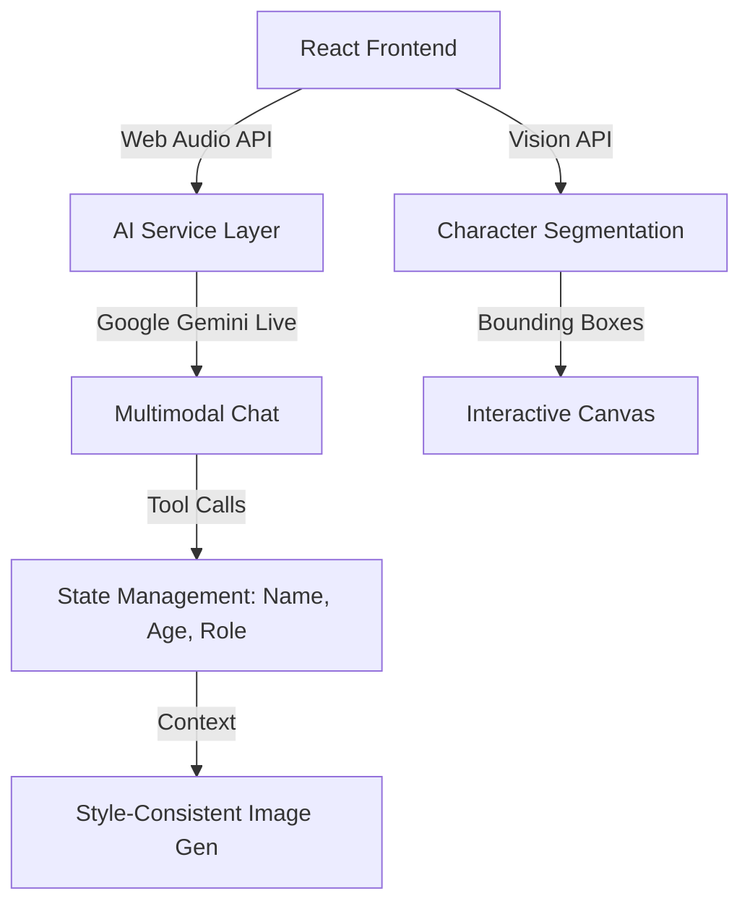

# 🏗️ DoodleTales: Architectural Nuances

DoodleTales is designed as a **Multimodal AI Agent** that bridges the gap between static drawings and dynamic storytelling. This document outlines the core architectural decisions and technical nuances that make the app unique.

## 1. High-Level Architecture

The application follows a **Full-Stack SPA (Single Page Application)** pattern with an Express backend serving as a proxy for Vite and API routes.

## 2. AI Service Layer

We implemented a clean service layer in `src/services/ai/` to handle AI interactions.

- **`AIService` Interface**: Defines standard methods for `segmentDrawing` and `generateStoryImage`.
- **`ChatService` Interface**: Defines standard methods for `connect`, `sendAudio`, and `sendImage`.

## 3. The "Style-Consistency" Nuance

A critical challenge in AI-generated art is maintaining a child's unique drawing style. DoodleTales solves this through **Style-Referenced Prompting**:

- **Reference Image Injection**: The original drawing is passed as `inlineData` (Gemini) in every image generation request.
- **Mandatory Style Instructions**: The system prompt explicitly forbids "improving" the drawing. It mandates:
  - Exact same colors and character designs.
  - Maintaining "stick figure" or "simple sketch" aesthetics.
  - **Face Consistency**: A strict instruction ensures that eyes, nose, mouth, and hairstyles remain identical to the original sketch.

## 4. Real-Time Multimodal Nuances

### Audio Processing
- **PCM 16kHz**: The frontend captures raw audio from the microphone, converts it to 16-bit PCM at 16,000Hz, and streams it via WebSockets (Gemini Live API).
- **Gapless Playback**: Incoming audio chunks are scheduled using the `Web Audio API`'s `currentTime` to ensure smooth, non-jittery speech.

### Tool Calling & State
The "Storytelling Scout" isn't just a chatbot; it's an agent with tools:
- `highlight_character(id)`: Used to visually signal which character the AI is talking about.
- `update_character_info(id, info)`: Used to persist names and roles learned during the conversation.
- `generate_story_image(prompt)`: Triggered when the story reaches a new scene.

## 5. Vision & Canvas Integration

### Bounding Box Normalization
Vision models return coordinates in a normalized `[0, 1000]` scale. The `LiveCanvas` component dynamically maps these to the actual pixel dimensions of the user's screen using a `ResizeObserver`, ensuring the "magical halos" always align perfectly with the drawing.

### Character Segmentation
The `segmentDrawing` function uses a high-reasoning model (`gemini-3-flash-preview`) to not just identify objects, but to understand their "role" in a potential story, which is then passed as initial context to the chat session.

## 6. Deployment Nuances

- **Cloud Run**: The app is containerized using a `Dockerfile` that builds the frontend and starts the Express server.
- **Environment Variables**: API keys are injected at runtime, ensuring no secrets are stored in the code.
- **Port 3000**: The app is hardcoded to port 3000 to comply with Google Cloud Run's default routing.
